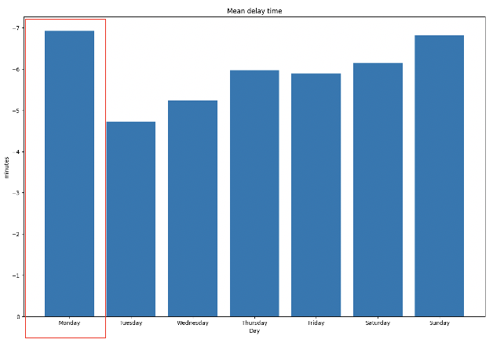
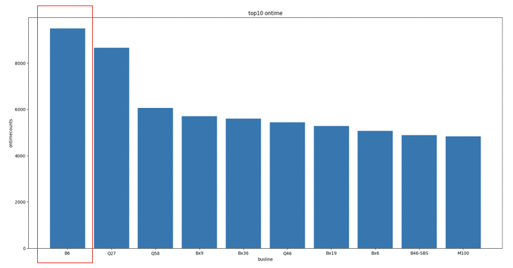
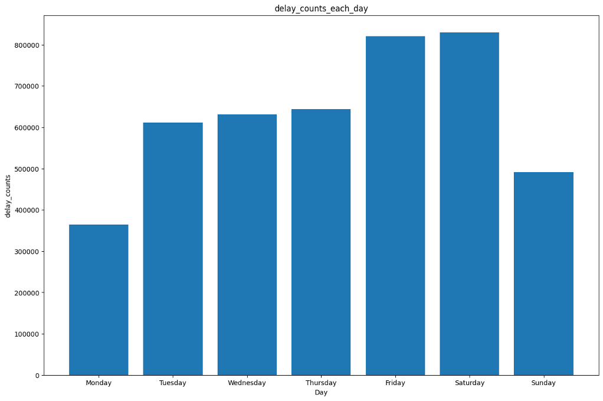
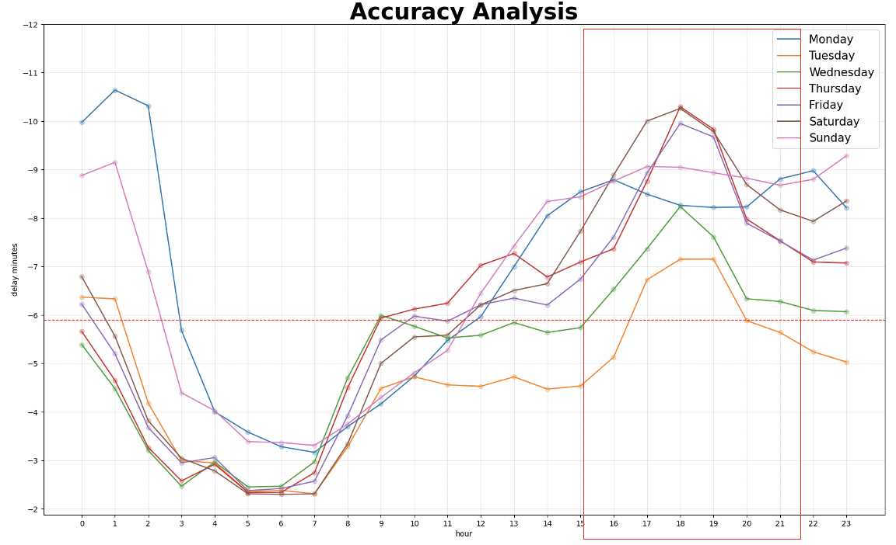
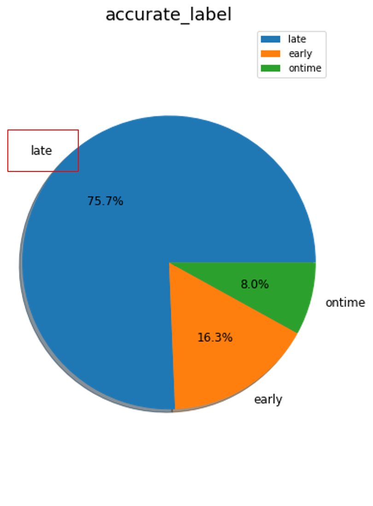

# NYC_Bus
NYC MTA Buses Data Stream Real-time Big Data Analysis.

## Motivation

- Although New York City has a famous subway system, 5,767 buses have been added to traffic operations since 2014 because of the long distance between stations. However, the lack of supporting decision-making tools led to the buses often jamming in the gridlock.

- In the above situation, many traffic survey methods can obtain research data, but most of these methods are limited by the need to stand at the intersection survey (such as speed gun), the data is hard to acquire (such as Inductive Loop Detector) or easy missing ( such as monitor recording).

## Problems

Machine learning modeling through NYC real-time bus data stream:

1. **Predict arrival time** and possible influencing factors.

2. **Classify whether the bus is delayed** and possible influencing factors.

## Dataset

- Kaggle:New York City Bus Data-Live data recorded from NYC Buses - Location, Time, Schedule & more.

- 2017.06, about 5.77 million records of data.

## Exploratory Data Analysis

## 1. Classification: 

- The **location of the bus**, **the distance between the previous & next station** are important variables for predicting early, on-time, and delayed.

- There are many bus routes in Brooklyn and Manhattan, and there are also many buses in Staten Island (especially on the north side) and Jamaica Bay.

- In Queens, Astoria, Jackson Heights, Forest Hills and other places with better security, the road network structure is relatively sparse; in Jamaica, Flushing and other places with poor security, local bus routes are relatively dense.

## 2. Regression: 

- The **location of the bus** is an important variable for predicting arrival time.

## Discussion and Results

- The prediction results of the classification model still need to be improved, and only **Random Forest has an accuracy of 58%**. Among them, the latitude of the bus, the longitude of the next station, the latitude of the next station, and the distance from the last station have more influence on the classification model.

- In the regression model, only the **MAE of DNN reaches 59%**, and the prediction ability of the other models is not good.

- Because the city is a complex system, it is necessary to try to eliminate the disaster of dimensionality in multivariate analysis; in addition, the data set does not have data on population, income, industry, etc., so it is difficult to establish a good prediction and classification model.
