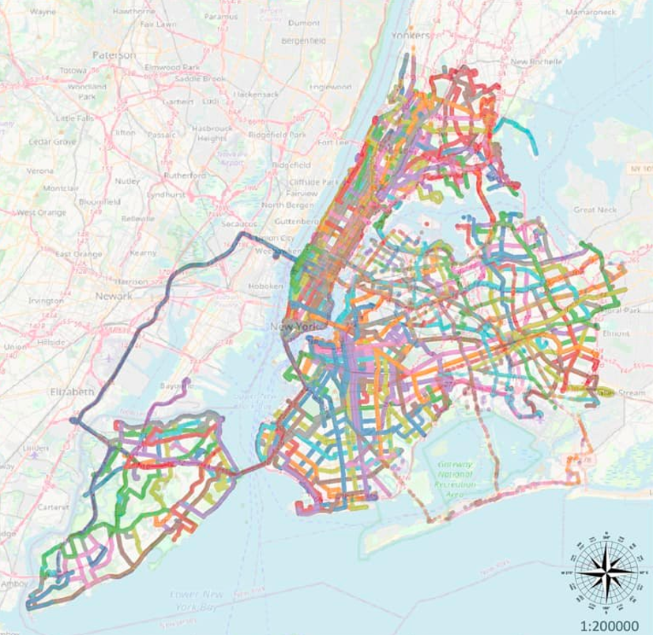
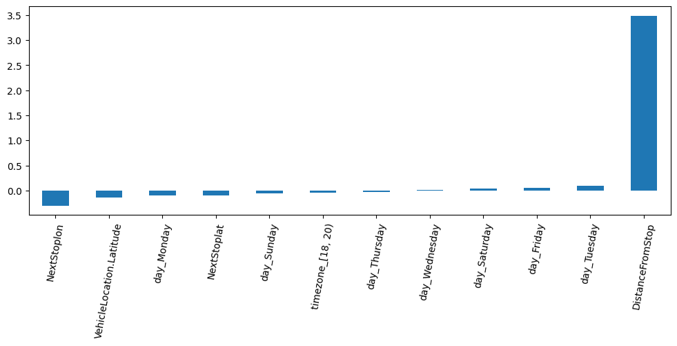
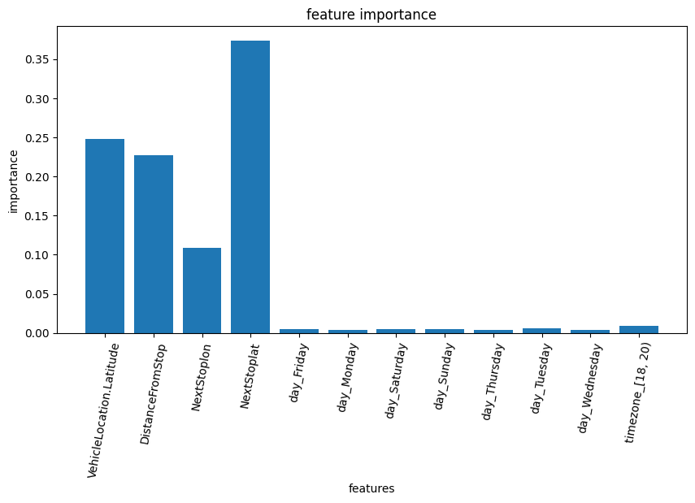
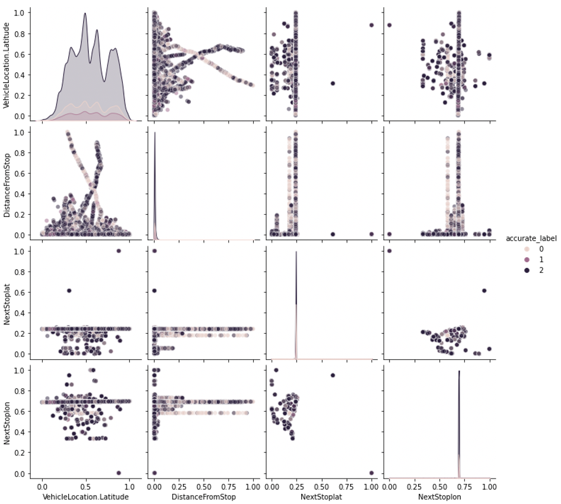
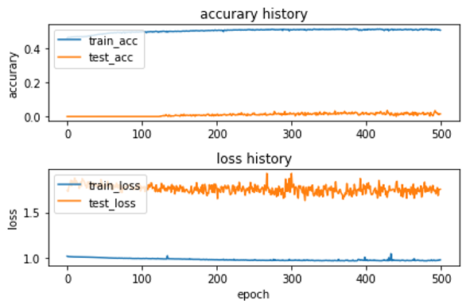

# NYC_Bus
NYC MTA Buses Data Stream Real-time Big Data Analysis.

## Motivation

- Although New York City has a famous subway system, 5,767 buses have been added to traffic operations since 2014 because of the long distance between stations. However, the lack of supporting decision-making tools led to the buses often jamming in the gridlock.

- In the above situation, many traffic survey methods can obtain research data, but most of these methods are limited by the need to stand at the intersection survey (such as speed gun), the data is hard to acquire (such as Inductive Loop Detector) or easy missing ( such as monitor recording).

## Problems

Machine learning modeling through NYC real-time bus data stream:

1. **Predict arrival time** and possible influencing factors.

2. **Classify whether the bus is delayed** and possible influencing factors.

## Dataset

- Kaggle:New York City Bus Data-Live data recorded from NYC Buses - Location, Time, Schedule & more.

- 2017.06, about 5.77 million records of data.

## Exploratory Data Analysis

- The period when the bus is easy to be delayed: 
The bus delay time is longer between 16 and 21 o'clock.

- Most delayed on Monday.

- The route with the most punctuality is B6.

- Number of delays per day of the week.

- 75% late,16% early, 8% ontime.

- Weekends are more prone to delays than weekdays.

## 1. Classification: 

The **location of the bus**, **the distance between the previous & next station** are important variables for predicting early, on-time, and delayed.

- Traffic conditions of New York City bus routes (326 routes in total).

- There are many bus routes in Brooklyn and Manhattan, and there are also many buses in Staten Island (especially on the north side) and Jamaica Bay.

- In Queens, Astoria, Jackson Heights, Forest Hills and other places with better security, the road network structure is relatively sparse; in Jamaica, Flushing and other places with poor security, local bus routes are relatively dense.

### Multinominal Logistic Classification

- Use SMOTE to oversampling to increase the minority samples, and TomekLinks undersampling to reduce the majority of samples, and then use LogisticRegressionCV to find the best C for models generated across folds of cross validation (CV)(for each class, the best C is the average of the C's that correspond to the best scores for each fold) , take the log from -7 to 1 to generate 20 equidistant numbers, there is a point in the interval of the log with the highest acuuracy, and the dotted line behind is a line generated by CV, take the averaged model is the black line.

- Performance on Training & Testing | Accuracy: 0.36, 0.32.

- Regression Coefficient Distribution.

### Random Forest Classifier

- Using RandomForestClassifier to model and visualize feature importance, it is found that next stop latitude is the most important variable, and through pairplot, the histogram distribution of each variable and the correlation diagram between two different variables.

- Performance in Training & Testing | Accuracy: 0.67, 0.58.

- Feature Importance.

- Pairplot.

### DNN Classification

- loss="categorical_crossentropy",optimizer='adam'
- Total params: 122,603

- Train Acc: 0.39, Test Acc: 0. 42.
- Train Loss: 1.16, Test Loss: 0. 99.

## 2. Regression: 

The **location of the bus** is an important variable for predicting arrival time.

### Linear Regression

### Polynomial Regression

-Coefficient of Determination: 0.04
-Mean Squared Error: 0.0003.

### DNN Regression

-Train MAE:0.59, Test MAE:0.59.
-Train Loss: 0.35, Test Loss: 0.35.

## Discussion and Results

- The prediction results of the classification model still need to be improved, and only **Random Forest has an accuracy of 58%**. Among them, the latitude of the bus, the longitude of the next station, the latitude of the next station, and the distance from the last station have more influence on the classification model.

- In the regression model, only the **MAE of DNN reaches 59%**, and the prediction ability of the other models is not good.

- Because the city is a complex system, it is necessary to try to eliminate the disaster of dimensionality in multivariate analysis; in addition, the data set does not have data on population, income, industry, etc., so it is difficult to establish a good prediction and classification model.
